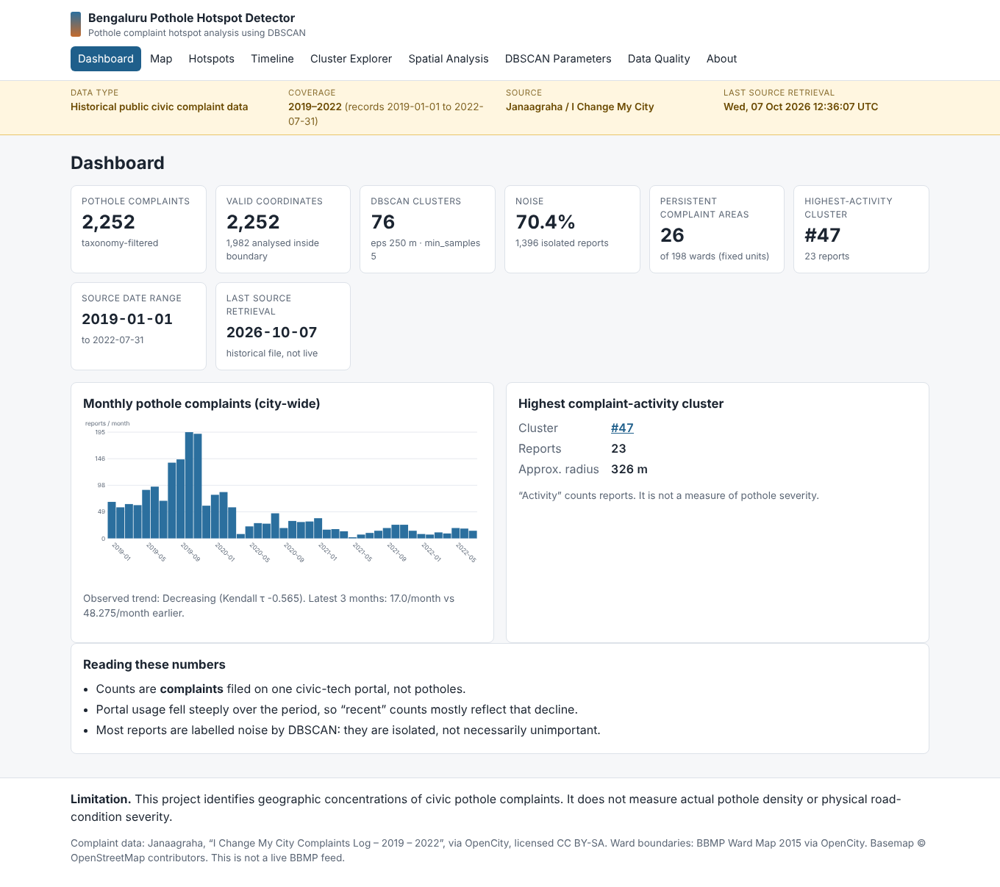
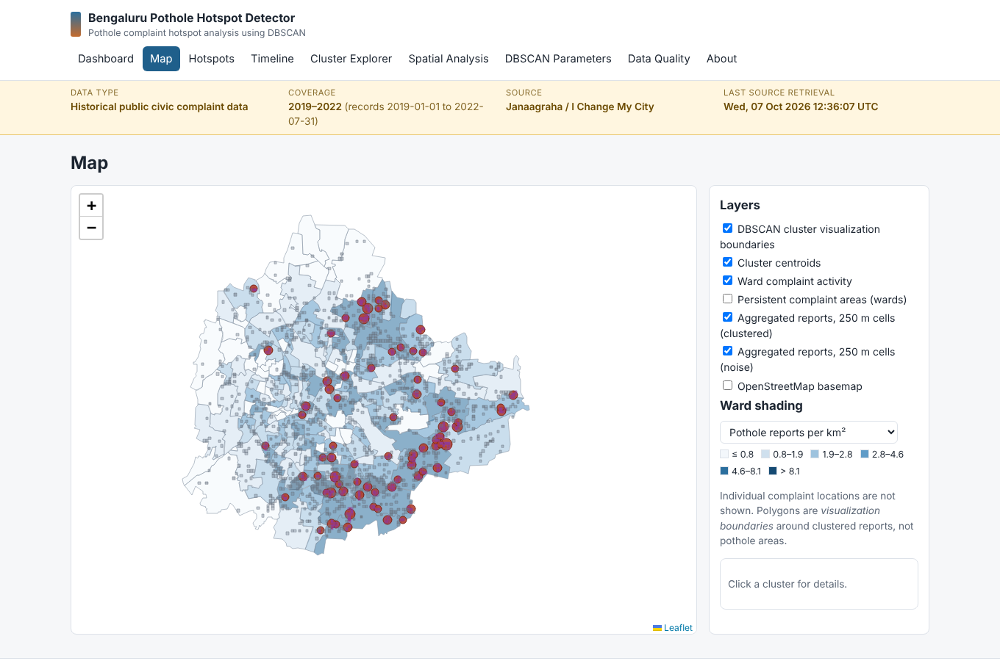
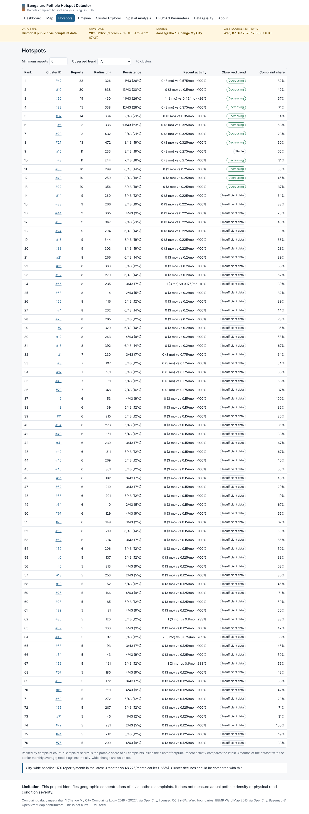

# Bengaluru Pothole Complaint Hotspot Analysis

**Bengaluru Pothole Complaint Hotspot Analysis using DBSCAN**

This is geographic concentrations of civic pothole **complaints**. It does not measure actual pothole density or physical road-condition severity
<p align="centre">


</p>

## Problem

Where are pothole-related civic complaints concentrating in Bengaluru, and which areas repeatedly show elevated complaint activity over time?
This project analyzes historical Bengaluru civic complaint data to identify geographic concentrations and persistent areas of pothole reporting. It combines geospatial preprocessing, Haversine-based DBSCAN clustering, parameter sensitivity analysis, non-pothole baseline comparison, temporal persistence testing, and a FastAPI + Leaflet dashboard.  
Important: the analysis measures complaint/reporting concentration, not physical pothole density, road-condition severity, or future pothole risk.
## Dataset

**Janaagraha / I Change My City – Complaints Log, 2019–2022**, hosted on [OpenCity](https://data.opencity.in/dataset/i-change-my-city-data) (CC BY-SA).

| | |
|---|---|
| Source | Janaagraha / I Change My City |
| Host | OpenCity (redistributor, not the originating authority) |
| Municipal context | Bengaluru civic complaints (BBMP area) |
| Measured date range | 2019-01-01 to 2022-07-31 (the file ends in July 2022) |
| Rows / pothole rows | 16,071 / 2,252 (taxonomy ids 66 and 594) |
| Pothole rows inside the BBMP 2015 ward union | 2,095 |
| Pothole rows clustered | 1,982 (113 reports at suspected default/fallback map pins excluded) |

Provenance, checksums, licences and measured data quality: [`DATASET.md`](DATASET.md), [`DATASET_FEASIBILITY.md`](DATASET_FEASIBILITY.md), `reports/data_feasibility.json`.

## What this project demonstrates

- Geospatial data cleaning and point-in-polygon analysis
- Haversine-distance DBSCAN clustering
- Parameter sweeps and clustering stability analysis
- Baseline comparison against non-pothole complaints
- Temporal trend and persistence analysis
- Statistical significance testing with Poisson/Binomial null models
- Benjamini–Hochberg multiple-testing correction
- Reproducible data ingestion with checksums and provenance
- Privacy-preserving analytical APIs
- FastAPI + SQLite + Leaflet dashboard
- Automated tests for analytical and API behavior

## Data status

**Historical, not real-time.** This is a static public export of a civic-tech portal, not a BBMP live feed. The UI states this on every page and shows the actual retrieval time.

A secondary, separately labelled source, **BBMP Fix My Street (May–June 2022)**, is used only for validation. It is never merged with the primary data.

## Method

DBSCAN on haversine distance (eps in **metres**) for spatial concentration, plus monthly analysis on fixed spatial units (198 BBMP 2015 wards):

1. Download → schema validation → Bengaluru boundary (ward union) → taxonomy-based pothole filter → coordinate validation → duplicate analysis
2. k-distance plot and a 60-configuration DBSCAN sweep, compared against a baseline made of random non-pothole complaint locations; silhouette is recorded but never used for selection
3. Monthly ward/cluster series, pothole ÷ all-complaints normalisation, persistence from a Poisson/Binomial null, observed trend (Kendall τ, Benjamini–Hochberg)

### Why DBSCAN

- the number of clusters is unknown in advance;
- complaint concentrations can be irregular in shape;
- isolated reports are labelled **noise** (−1) and reported, not forced into clusters;
- the criterion (local density) matches the question.

Its main weakness here is also documented: a single global density threshold under-detects sparse areas (see [`reports/analysis_report.md`](reports/analysis_report.md)).

## Pipeline

```
OpenCity / Janaagraha CSV ─► download (checksum, retrieved_at) ─► schema validation
   ─► Bengaluru filter (BBMP 2015 ward polygons) ─► pothole taxonomy filter
   ─► coordinate validation ─► duplicate analysis ─► SQLite (no free text)
   ─► k-distance + DBSCAN sweep + baseline ─► clusters
   ─► monthly ward/cluster analysis ─► normalisation, persistence, trend
   ─► reports/ + SQLite artifacts ─► FastAPI ─► dashboard + map
```

## Results (actual, from `python scripts/run_pipeline.py`)

Using 1,982 usable pothole complaint observations:

| Metric | Result |
|---|---:|
| Selected DBSCAN | eps = 250 m, min_samples = 5 |
| Spatial clusters | 76 |
| Clustered reports | 586 |
| Noise reports | 1,396 (70.4%) |
| Persistent wards | 26 / 198 |
| Largest cluster | 23 reports |
| Baseline clusters | 48.4 ± 6.2 |
| HDBSCAN clusters | 127 |

### What the results mean

Pothole complaints are more spatially concentrated than randomly sampled non-pothole complaints from the same portal. However, the difference is partly explained by uneven civic-portal usage.

The analysis therefore identifies **hotspots of pothole reporting**, not confirmed concentrations of physical potholes.

Full discussion, including over-/under-clustering and parameter sensitivity: [`reports/analysis_report.md`](reports/analysis_report.md).

## Dashboard

Pages: Dashboard, Map, Hotspots, Timeline, Cluster Explorer, Spatial Analysis, DBSCAN Parameters, Data Quality, About. Screenshots are captured from the running app (basemap tiles off in the sandbox):

| Dashboard | Map |
|---|---|
|  |  |



The UI reports *complaint activity*, *spatial density*, *persistence* and *recent activity*, never pothole severity. Individual complaint locations are not shown; the map uses cluster visualization boundaries and 250 m aggregate cells.

## API

| Endpoint | Purpose |
|---|---|
| `GET /` and the page routes `/map /hotspots /timeline /clusters /spatial /parameters /quality /about` | Dashboard pages |
| `GET /health` | Liveness and whether an analysis exists |
| `GET /api/summary` | Headline figures |
| `GET /api/hotspots`, `GET /api/hotspots/{id}` | Hotspot table / cluster detail (sort and filter params) |
| `GET /api/clusters` | Cluster boundaries and centroids (GeoJSON) |
| `GET /api/timeline` | Monthly series (`unit_type=city\|ward\|cluster`) |
| `GET /api/spatial-units` | Ward-level metrics and persistence definition |
| `GET /api/data-status` | Provenance, retrieval metadata, gate result |
| `GET /api/parameters`, `/api/quality`, `/api/grid` | Sweep, data quality, aggregated cells |

Read requests only serve precomputed results.

## Limitations

- Complaints are not potholes: no physical measurement, no severity, no ground truth.
- Reporting bias: uneven portal adoption, awareness, civic engagement and population. Pothole ÷ all-complaints normalisation helps but does not remove this.
- Historical data ending 2022-07-31 with a steep fall in usage.
- Some coordinates are locality-level or default pins; the exclusion rule (≥ 8 complaints at one exact coordinate) is a heuristic.
- City boundary is the 2015 ward union; reports outside it are excluded.
- DBSCAN uses one global density threshold; results are sensitive to parameters.
- The source has no request identifier; repeated reports cannot be tied to unique potholes or people.

## Setup

```bash
python -m venv .venv && source .venv/bin/activate
pip install -r requirements.txt

python scripts/run_pipeline.py          # download, preprocess, DBSCAN, temporal analysis, reports
pytest                                  # tests
uvicorn src.api.app:app --port 8000     # then open http://localhost:8000
```

Individual stages: `scripts/download_data.py`, `preprocess.py`, `run_dbscan.py [--eps M --min-samples N]`, `run_temporal_analysis.py`. Browser smoke test against a running server: `python scripts/smoke_ui.py http://localhost:8000`.

Raw and processed data are not committed (`data/raw`, `data/processed`); the downloader records `retrieved_at`, size and SHA-256 under `data/metadata/`.

## Attribution

Complaint data: Janaagraha, *I Change My City Complaints Log – 2019 – 2022*, via OpenCity, licensed **CC BY-SA**. Derived aggregates here are shared under the same terms.
Ward boundaries: *BBMP Ward Map – 2015* via OpenCity (licence not specified in the source metadata).
Secondary data: *BBMP Fix My Street Data – May and June 2022* via OpenCity (public domain).
Basemap © OpenStreetMap contributors. Map library: Leaflet (BSD-2-Clause), vendored in `src/api/static/vendor`.
